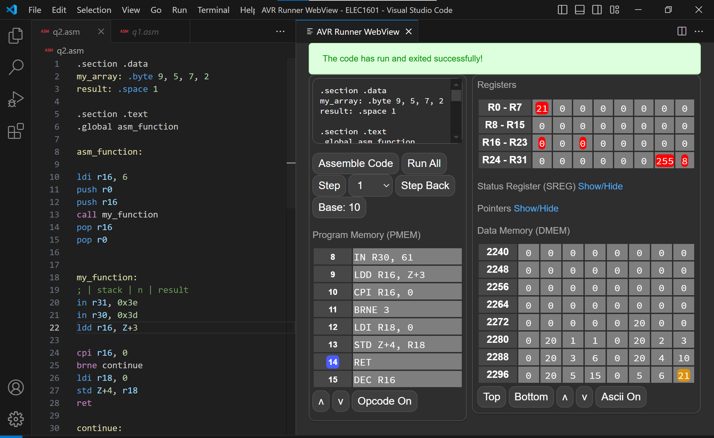

# AVR Runner

### A VSCode Extension that runs AVR Code
This is a VSCode extension that runs AVR Code using jonopriestley's [avrsim](https://github.com/jonopriestley/avrsim).

## Usage
To use the extension: 
1. Install "AVR Runner" on VSCode Extension Marketplace.

2. Write AVR code in .asm files and press alt+r to start the extension. Then you can do all the actions on the right panel (such as assemble code, run all, etc). Note the extension autmatically updates the code to the right on file save. 

## New Version
v0.1.3: Prettified HTML  
v0.1.2: Added PMEM and re-organized HTML  
v0.1.1: Added code colouring support  
##### v0.1.0:  
- Solved issue that cannot open WebView panel twice.
- Updated so that the extension autmatically updates the code to the right on file save. 
- Uploaded on GitHub.