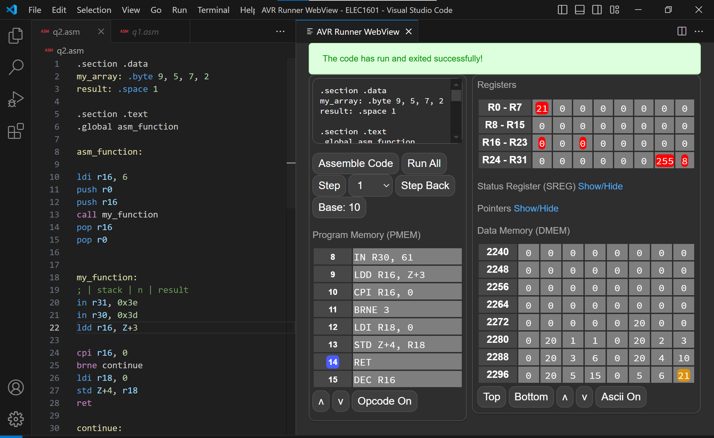

# AVR Runner

### A VSCode Extension that runs AVR Code
This is a VSCode extension that allows users to run AVR code using [avrsim](https://github.com/jonopriestley/avrsim).

## Usage
To use the extension: 
1. Install "AVR Runner" on VSCode Extension Marketplace.

2. Write AVR code in .asm files and press alt+r to start the extension. This will start a new panel on the right.

3. On the right panel, first press `Assemble Code`. Then you can choose to `Run All` which runs all the code at once, or `Step` which runs the number of lines specified. Other buttons should be self-explanatory.  
Note the extension autmatically updates the code to the right on file save. 

## New Version
v0.1.5: Added more README
v0.1.4: Solved issue where Webview refocused retreives outdated code  
v0.1.3: Prettified HTML